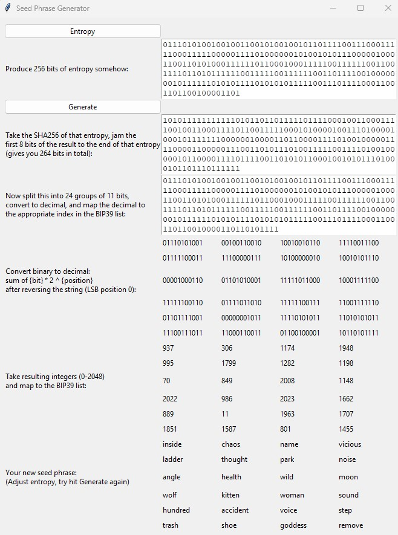

# 24 Word Seed Generator

If you're wondering how the 24 words get produced when you're creating a new recovery phrase for a crypto wallet, look no further.

Sadly it's no great secret: your 'phrase' is 264 bytes of binary.

Here's an illustration.

## How To

Run `./python seed-generator.py`. You will need Python 3 and the module tkinter (e.g. `pip3 install tkinter`, `brew install python-tk`
 or `sudo apt-get install python3-tk`).

It's not pretty, and it's got a crap UI (I am not good at front-end).

Click `Entropy` to generate 256 bits.

Then click `Generate` to do the rest - how the pieces are formed is explained with labels.

## Tinker Around

Try edit the binary a bit and click `Generate` again - see how the words change based on what parts you edit.

Congratulations, you have now seen the wizard behind the curtain.

I'll flesh this out more with an explanation if people ask.

## Acknowledgements

Thanks to [Xavier Lavayssière](https://www.twitter.com/XavierLava) for PR on alignment and better documentation on requirements.